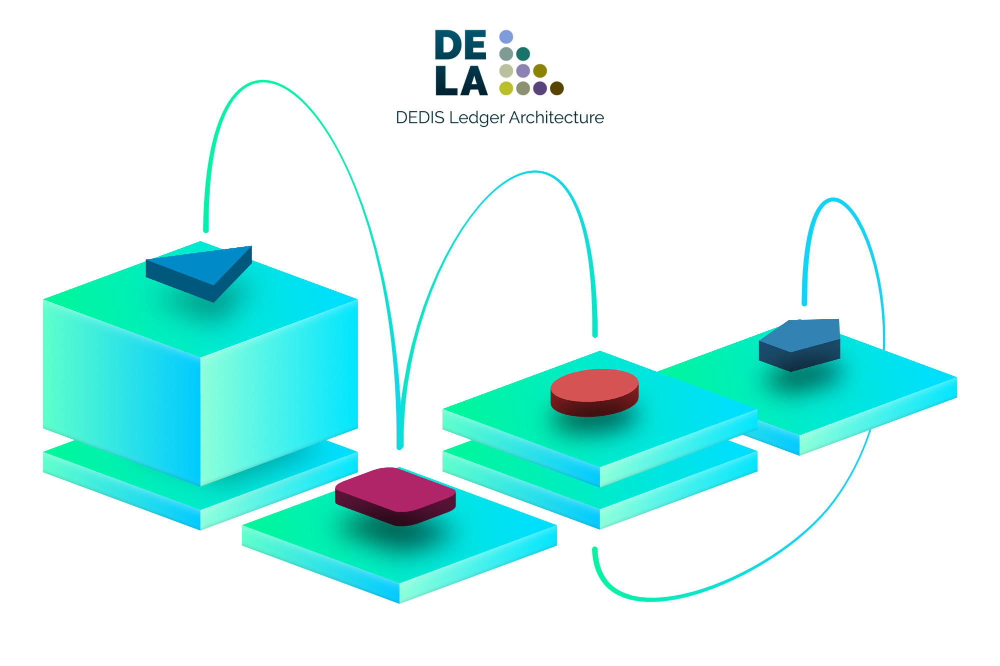
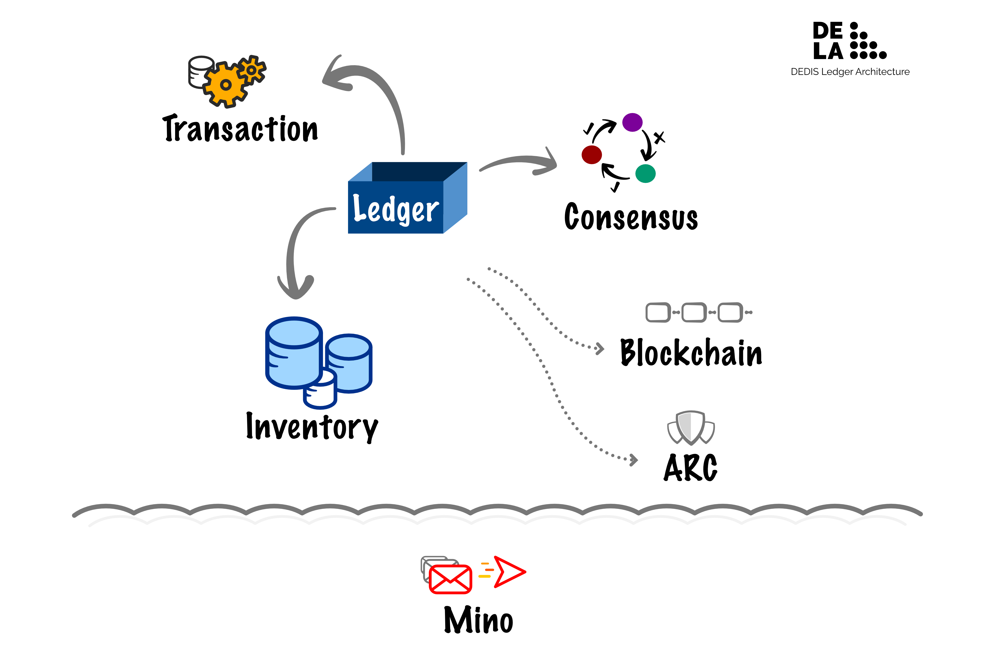

# Dela

Dela stands for DEDIS Ledger Architecture. It is both a set of abstractions and
an implementation of a distributed ledger architecture.

Dela has 2 main purposes:

- Provide a modular, global-purpose, and universal framework that describes a
  minimal and extended set of abstractions for a distributed ledger
  architecture.
- Provide multiple modules implementations that can be combined to run a
  distributed ledger.

With Dela you can:

- Learn the architecture of a distributed ledger
- Run your blockchain / distributed ledger
- Implement and test your new idea that will revolutionize the blockchain world
  by adding your new module's implementation to the Dela ecosystem

## Distributed ledger

A distributed ledger aims to solve the following problem: how can a set of
entities agree on a state without any central entity? In other words: how can a
group of computers (or *nodes*) cooperate to maintain a database? This problem
is not new and has been solved with, for example, distributed databases. With
distributed databases, multiple replicas of a database are kept in different
locations and constantly maintained to have the same view on the data. If a
replica fails or stops responding, another copy is ready to take the relay.
Distributed ledgers are not that different from distributed databases except
with one major point: parties - or *nodes* - don't trust each other. Where a
distributed database can use a set of trusted *cooperative* nodes, a distributed
ledger is rather a set of untrusted *foreigners* entities that must find a way
to agree on a state. Distributed databases can be compared to a set of friends
that keep collectively the amounts that everybody owes to each other, while a
distributed ledger would be doing the same but with everyone in your city (do
you trust everyone in your city to tell you how much you owe to your friend?).

A notorious application of a distributed ledger is Bitcoin, which uses a
blockchain data structure and a mining protocol (*Proof-of-Work*) to maintain a
consistent and decentralized list of coin transactions. This global list of
transactions (or *ledger*) is what allows the existence of a such decentralized
crypto-currency.

## Architecture

What is the best and minimal recipe for a distributed ledger architecture? We
asked ourself the same and came out with the following core ingredients:

- We first need an **overlay** module, which is responsible for transmitting
  messages from one entity to another one. If a group of human wants to talk and
  agree on a state, the overlay would be the common speaking language and the
  vocal cords that allow the persons to communicate and exchange pieces of
  information. With Dela, the overlay layer is called "Mino" for "Minimalist
  Network Overlay".
- Secondly, we need a **consensus** module, which describes how a set of
  entities can interact to agree on something. Most of the time it comes to the
  form of a zero/low trust interaction protocol. For example, in a teaching
  class, a common consensus is that the first to raise its hand can speak
  and propose a solution. The consensus is the core part of a distributed ledger
  that makes the agreement on a state possible.
- Then, we need a **ledger** module, which keeps track of
  events and decisions that occur among the entities. In real life we easily
  keep track of elements by using a pen and paper. The ledger abstraction is the
  main entry point that provides the end-user operations. The ledger module
  holds the **will** to keep track of things, but it actually does not have a
  pen and paper. For that it will make use of the other module. As such, the
  ledger module is mainly an orchestrator.
- We then need a **transaction** module, which describes *how* elements must be
  written on the ledger. If we had to use a transaction module when we write
  something on a paper, it would be the entity that tells us to write things
  word by word, or sentence by sentence (but don't stop in the middle of a
  word!).
- Finally, we need an **inventory** module, which describes *where* elements on
  the ledger are saved. In fact, there are a lot of mediums to store data, like
  writing data to a file or using volatile memory. In real life, we also have
  loads of means to store information, for example on papers, in our brain, or
  even stone tablets. All have their advantages and Dela doesn't stick to one
  particular solution. As with all our modules, Dela offers the ability to use
  any implementation that satisfies the module's requirements.

The **Ledger** module plays the central part of welcoming incoming clients'
requests and processing them by using the other modules. The 5 modules we
described above are the minimal set of modules needed to run a distributed
ledger, what we call the "core" modules. There are some other modules, called
"additional" modules that can be used for more specific distributed ledgers.
Those are:

- The **blockchain** module, which can be used for blockchain-based distributed ledgers.
- The **ARC** modules, that stands for "Access Right Control" and can be used
  for specific permissioned ledger.

To end this overview on Dela's architecture, here is an illustration that
describes the interactions between the elements we described so far:

The **Overlay** module is a transversal layer that is used by each other
modules.

## Complete packages dependencies

This is still a WIP, here is the current interactions between the packages:

## Terminologies

- **actor** - An actor is a player of a protocol or a module. It is intended to
  be accessible only after the initialization and it provides the primitives to
  start the underlying protocol logic.

- **arc** - Arc stands for Access Rights Control. It is the abstraction that
  controls the access to the instances.

- **blockchain** - A blockchain is a distributed and immutable storage
  abstraction. A well-defined threshold of participants work together to reach a
  consensus on every block.

- **cosi** - CoSi stands for *Collective Signature*. It represents an aggregate
  of signature from multiple key pairs and it can be verified by the
  corresponding aggregate of public keys.

- **fingerprint** - Fingerprint defines a digest commonly produced by a hash
  algorithm that can be used to verify the integrity of some data. One example
  is the inventory page integrity to prove which instances are stored.

- **governance** - Governance is a black box that gives the ability to act on
  the participants of a consensus.

- **instance** - An instance is the smallest unit of storage in a ledger. It is
  identified by a unique key and stores a generic piece of data.

- **inventory** - An inventory is the storage abstraction of a ledger. The
  ledger evolves alongside with the blocks and that is represented by pages in
  an inventory where the index matches the block index.

- **ledger** - A ledger is a book of records of transactions. Similarly, a
  public distributed ledger can be implemented on top of a blockchain.

- **message** - A message is a serialized data structure that can be transmitted
  over a physical channel and decoded on the other side.

- **mino** - Mino stands for *Minimalist Network Overlay*, it is the abstraction
  that defines how to register and use RPCs over a distributed set of nodes.

- **node** - A node is a server participating in a protocol.

- **payload** - A payload is the data that a block will store. The blockchain
  implementation does not know the data structure thus requires a
  *PayloadProcessor* that will validate during the consensus.

- **proof** - A proof is a cryptographic tool that can provide integrity to a
  piece of data.

- **protobuf** - https://developers.google.com/protocol-buffers/

- **roster** - A roster is a set of participants to a protocol.

- **RPC** - RPC stands for *Remote Procedure Call*. It represents a procedure
  that an authorized external actor can call to get a specific result.

- **skipchain** - A skipchain is a specific implementation of the blockchain
  that is using collective signings to create shortcuts between blocks.

- **task** - A task is an order of execution that is stored inside a
  transaction. It will define how the transaction will update the inventory.
